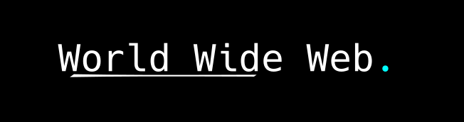

# Warkop html dan css



Saat ini penggunaan website dan permintaan akan website terus bertambah. Sudah menjadi hal biasa bagi kita untuk mengakses website setiap hari, mulai dari mencari informasi, mengikuti seminar, sampai menghadiri acara online. Dengan meningkatnya penggunaan website, tidak ada salahnya kalau kita belajar membuat website sendiri. Meskipun tidak untuk dijual, setidaknya bisa untuk keperluan pribadi, seperti membuat website portofolio misalnya.

Website terdiri dari halaman atau sekumpulan halaman yang saling terhubung dan berisi informasi atau data yang disediakan oleh pemiliknya. Pemilik website bisa perorangan, kelompok, atau organisasi. Website biasanya ditempatkan pada webserver dan untuk mengaksesnya dibutuhkan jaringan yang menghubungkan sisi client dengan sisi server.

### Table content

- [Mulai HTML](document/html.md)
- [Mulai CSS](document/css.md)
- [Mulai Javascript](document/javascript.md)
- [Mulai SQL](document/sql.md)
- [Mulai Ruby](document/ruby.md)
- [Mulai Vim](document/vim.md)
- [Mulai Python](document/python.md)
- [Mulai Git](document/git.md)
- [Mulai_React](document/react.md)
- [Mulai React Expo](document/expo/expo.md)
- [TypeScript](document/typescript.md)
- [Mulai R](document/R.md)
- [Mulai Bahasa Jawa(Java)](document/javac/java.md)
- [Mulai Vue Js](document/vue.md)
- [Mulai LaTeX](document/latex.md)
- [Mulai Data Science](document/DataScience/Intro.md)

# Pengenalan Pembelajaran

Mempelajari materi dengan bertahap adalah kunci untuk memahami sesuatu dengan baik.

Tujuan dari pembelajaran ini adalah membuat pembaca setidaknya bisa membuat website mereka sendiri, baik itu static website maupun dynamic website.

Dalam membuat website sederhana, setidaknya dibutuhkan 1 web browser dan 1 text editor yang berjalan bersamaan untuk mempermudah pengelolaan. Web browser digunakan untuk melihat tampilan dan cara kerja website, sedangkan text editor dibutuhkan untuk menambahkan atau mengelola fitur di dalam website.

Kamu bisa menggunakan web browser dan text editor sesuai keinginan sendiri, tidak perlu harus mengikuti apa kata orang lain. Kalau kamu suka dengan tools tertentu, ya pakai saja. Pada dasarnya web browser dan text editor hanyalah alat bantu untuk mempermudah pekerjaan kita.

Sebagai contoh, saya menggunakan emacs-doom dan chromium dalam pembuatan website. Emacs-doom memiliki banyak fitur yang membantu saya menulis kode dengan lebih efisien.

# Mengenai Website

Sebuah website ditulis dengan aturan HTML atau XHTML, dan terkadang berisi bahasa script untuk membuat website lebih interaktif.

Beberapa protokol dalam website:
- HTTP (Hypertext Transfer Protocol)
HTTP adalah protokol permintaan dan respons, dimana client melakukan permintaan kepada server dan akan dibalas dengan informasi atau data yang tersedia di server.
- HTTPS (Hypertext Transfer Protocol Secure)
HTTPS memiliki cara kerja yang hampir sama dengan HTTP. Perbedaannya adalah adanya enkripsi TLS (Transport Layer Security) tambahan untuk meningkatkan keamanan jaringan. Penambahan keamanan ini salah satunya berada di sisi server.

Mengenai website dinamis dan statis:
- Website statis adalah sekumpulan dokumen atau halaman yang hanya bisa diubah secara manual. Di dalam web statis tidak tersedia database dan web server framework (contoh: Django, Node.js). Biasanya terdiri dari HTML, CSS, dan JavaScript (JavaScript hanya untuk tampilan saja).
- Website dinamis adalah sekumpulan dokumen atau halaman yang bisa dengan mudah berubah dan beroperasi sesuai keinginan pembuatnya. Di dalamnya ada local storage atau database untuk menyimpan data. Website ini dibangun dengan sistem yang lebih kompleks (contoh: Instagram, Facebook).

## Mengenal Web Developer

Web developer adalah programmer yang memiliki spesialisasi dalam pembangunan aplikasi World Wide Web. Ada tiga macam teknologi utama yang dipakai yaitu:
- HTML, CSS dan JavaScript biasanya dipakai sebagai teknologi untuk menampilkan dokumen website
- PHP, ASP.NET (C#), Python, Node.js, Go atau Java adalah teknologi yang dipakai untuk mengelola cara kerja website
- Apache2 dan Nginx berfungsi sebagai HTTP server yang menghubungkan client dan server

Di dalam pekerjaan web developer ada tiga macam kategori, yaitu Front-end web developer, Back-end web developer, dan Full stack web developer.

- Front-end web developer bertugas mengelola Graphical User Interface dari website. Membuat User Interface dan User Experience yang bisa diterima oleh client.
- Back-end web developer bertugas mengelola HTTP server dan database. Memastikan website bisa bekerja dengan baik.
- Full stack web developer memiliki tugas untuk mengelola kedua bagian tersebut.

### Cara Membuat Website Disukai Mesin Pencari dan Pengguna

Membuat website yang bisa bekerja sesuai perintah dan memastikan client memiliki pengalaman bagus saat menggunakannya adalah hal penting. Di era industri seperti saat ini, peningkatan kualitas website adalah hal yang wajib. Dengan membuat website lebih ringan dan simpel akan meningkatkan jumlah pengunjung, bahkan jika waktu loading website bisa dipersingkat hanya satu detik saja.

Mesin pencari dan pengunjung menyukai website yang cepat diakses dan memiliki informasi halaman yang jelas.

# Cara Komputer Berpikir dan Bekerja

Komputer di era ini sangat dibutuhkan, mulai dari penyimpanan data, pengolahan data, dan berbagai macam hal lainnya. Komputer memiliki banyak bentuk mulai dari handphone, laptop, personal computer, dan lain-lain. Meskipun bentuk komputer beragam, pada dasarnya cara kerjanya sama.

Komputer pada dasarnya menggunakan binary untuk melakukan komunikasi. Nomor binary dibuat dari sekumpulan binary digits (bits), contohnya 1001.

Sirkuit dalam prosesor komputer dibuat dari jutaan transistor. Transistor adalah perangkat switch kecil yang diaktifkan dengan sinyal elektronik. Angka 1 dan 0 yang digunakan pada binary merepresentasikan status hidup dan mati dari transistor.

Pada dasarnya komputer itu hanyalah mesin bodoh, kita tidak perlu takut dengan komputer. Komputer hanya bisa menghitung angka mulai dari 0 dan 1. Kita terbiasa melakukan perhitungan mulai dari 0 sampai 9 (Decimal) sedangkan komputer mulai dari 0 sampai 1 (Binary). Bahasa pemrograman yang kita kenal bukanlah bahasa komputer asli, melainkan bahasa penerjemah untuk membantu programmer menulis perintah.

```
128 - 64 - 32 - 16 - 8 - 4 - 2 - 1
0      0    0    0   0   0   0   0
```

Mengubah angka Binary ke Decimal, contoh:
- 0101 = 5
- 1001 = 9

Mengubah angka Decimal ke Binary, contoh:
- 18 = 10010
- 55 = 110111

Cara kerja komputer:
1. CPU bertanya apakah ada perintah kepada RAM
2. CPU mengambil permintaan dari RAM, lalu mengerjakannya
3. Mengembalikan data yang sudah diolah kepada RAM
4. CPU bertanya kembali apakah ada perintah kepada RAM dan terus berlanjut hingga selesai

Kenapa RAM memiliki kecepatan transfer data yang luar biasa? RAM bekerja paling dekat dengan CPU untuk menyediakan data yang akan diolah. Analoginya seperti di dapur restoran: RAM adalah meja kerja, hardisk adalah tempat penyimpanan bahan baku, CPU adalah chefnya, VGA adalah kemampuan chef untuk memasak. Tanpa adanya chef yang bisa memasak, semua peralatan itu tidak akan menghasilkan apa-apa.

Prosesnya: pembeli membuat permintaan, permintaan diambil, chef mengolah makanan, makanan disajikan. Jika pembeli masih meminta sesuatu, proses akan dilanjutkan hingga akhir. Sebagai catatan, pembeli itu adalah kita yang meminta permintaan.

### Mengenai SSH

Secure Shell (SSH) adalah salah satu protokol jaringan dengan nomor port 22. SSH digunakan untuk melakukan komunikasi dengan server dengan aman. SSH akan melakukan enkripsi pada data yang terkirim, sehingga data tersebut tidak mudah dibaca oleh pihak yang tidak berwenang.

SSH bekerja dengan sistem client server. Client menghubungi server SSH untuk melakukan pekerjaan di sana. Pekerjaannya bisa bermacam-macam, seperti kontrol terminal, file copy, dan lain-lain.

#### Referensi
- Beberapa buku yang pernah saya baca, tapi lupa namanya
- alva jonathan / <https://www.instagram.com/lucky_n00b.oc/?hl=id>
- <https://www.rapidtables.com/convert/number/decimal-to-binary.html>
- <https://www.instructables.com/Computers-are-Dumb/>
- <https://www.dummies.com/programming/how-does-a-computer-program-work/>
- <https://www.bbc.co.uk/bitesize/guides/zwsbwmn/revision/1>
- <http://www.steves-internet-guide.com/binary-numbers-explained/>
- <https://www.bbc.co.uk/bitesize/guides/zwsbwmn/revision/1>

#### Pranala Menarik
- [History of Internet by Internet Society](https://www.internethalloffame.org/brief-history-internet)
- https://www.nginx.com/
- https://en.wikipedia.org/wiki/HTTPS
- https://en.wikipedia.org/wiki/Web_development
- https://en.wikipedia.org/wiki/Web_developer
- https://en.wikipedia.org/wiki/Front-end_web_development
- https://www.dewaweb.com/blog/web-developer/
- https://httpd.apache.org/
- https://glints.com/id/lowongan/pekerjaan-back-end-developer/#.YU1Mv4BBw3w
- <https://id.wikipedia.org/wiki/Situs_web>
- <https://id.wikipedia.org/wiki/HTTPS>
