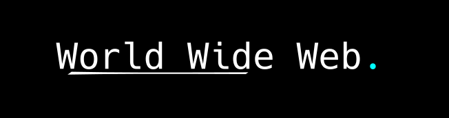

# Warkop html dan css



Pada saat ini pengunaan website dan permintaan akan suatu website terus bertambah.
menjadi hal biasa kita mengakses website setiap hari. mencari informasi mengikuti
seminar atau acara online. dengan peningkatan pengunaan website maka tidak ada salahnya
jika kita belajar untuk membuat website. meskipun tidak untuk dijual tapi untuk diri kita sendiri, sebagai contoh membuat website portofolio.

Website berisi halaman atau sekumpulan halaman yang saling terhubung berisi dengan informasi atau data yang disedikan oleh penyedia. Penyedia website bisa dari perorangan, kelompok atau organisasi. suatu website biasannya ditempatkan pada suatu webserver dan untuk mengaksesnya dibutuhkan jaringan yang menghubungkan sisi client dengan sisi server.


### Table content

- [Mulai HTML](document/html.md)
- [Mulai CSS](document/css.md)
- [Mulai Javascript](document/javascript.md)
- [Mulai SQL](document/sql.md)
- [Mulai Ruby](document/ruby.md)
- [Mulai Vim](document/vim.md)
- [Mulai Python](document/python.md)
- [Mulai Git](document/git.md)
- [Mulai_React](document/react.md)
- [Mulai React Expo](document/expo/expo.md)
- [TypeScript](document/typescript.md)
- [Mulai R](document/R.md)
- [Mulai Bahasa Jawa(Java)](document/javac/java.md)
- [Mulai Vue Js](document/vue.md)

# Pengenalan Pembelajaran

Mempelajari materi dengan bertahap adalah kunci untuk memahami.

Tujuan dari pembelajaran ini adalah membuat pembaca agar bisa setidaknya bisa membuat website mereka sendiri,seperti static website maupun dynamic website.

Dalam membuat website sederhana dibutuhkan setidaknya 1 web browser dan 1 texteditor yang berjalan bersamaan untuk mempermudah dalam pengelolaan.
web browser digunakan untuk melihat seperti apa website ditampilkan dan bekerja, text editor dibutuhkan untuk menambahkan fitur atau mengelola sebuah fitur didalam website. 

pengguna bisa mengunakan web browser dan text editor sesuai keinginan mereka, tidak perlu harus mengikuti apa kata orang lain. jika anda suka itu maka pakai saja.
pada dasarnya web browser dan text editor hanyalah sebuah alat yang membantu pengguna untuk membantu.

sebagai contoh, saya mengunakan emacs-doom dan chromium dalam pembuatan website. emacs-doom memiliki segudang fitur yang dapat membantu saya menulis sebuah kode.

# Mengenai website

sebuah website ditulis dengan aturan html atau xhtml, terkadang berisi dengan bahasa script untuk membantu website lebih hidup.

Beberapa protocol dalam website:
- HTTP (Hypertext Transfer Protocol)
HTTP adalah suatu protocol permintaan-respons, dimana client akan melakukan perminataan kepada server dan akan dibalas dengan informasi atau data yang tersedia dalam server.
- HTTPS (Hypertext Transfer Protocol Secure)
HTTPS memiliki cara kerja yang hampir sama dengan HTTP, perbedaan adalah disana terdapat enkripsi TLS ( Transport Layer Security )tambah untuk meningkatkan keamanan jaringan. Penambahan kemanan salah satunnya berada di sisi server.

Mengenai website dinamis dan statis:
- website statis
adalah sekumpulan dokumen atau halaman yang hanya bisa dirubah secara manual. didalam web statis tidak tersedia database dan web server framework ( contoh: django, nodejs ). biasanya terdiri dari html, css dan javascript ( javascript hanya untuk tampilan saja ).
- website dinamis
adalah sekumpulan dokumen atau halaman yang bisa dengan mudah berubah dan bisa beroperasi sesuai dengan keinginan sang pembuat website. didalam sana ada local storage atau database untuk menyimpan data. dibangun dengan sistem yang complex ( contoh website dinamis: instagram, facebook )

## Mengenal Web developer
Web developer adalah programmer yang memiliki spesialisasi dalam pembangunan suatu World Wide Web application. Ada Tiga macam tipe application yang dipakai yaitu;
- HTML, CSS dan javascript biasannya ini dipakai sebagai application penampil document website
- PHP,ASP, NET (C#), python, Node.js, Go atau Java adalah application yang dipakai untuk mengelolah cara Kerja website
- Apache2 dan Nginx Berfungsi sebagai HTTP server. HTTP digunakan untuk menghubungkan client dan server


Didalam pekerjaan web developer ada tiga macam class, yaitu Front-end web developer, Back-end web developer dan Full stack web developer.

- Front-end web developer bertugas mengelola 'Graphical User Interface' dari website. Membuat User Interface dan User Experience yang bisa diterima oleh client.
- Back-end web developer bertugas mengelola HTTP server dan database. Memastikan website bisa bekerja dengan baik.
- Full stack web developer memiliki tugas untuk mengelola kedua bagian tersebut.

### cara untuk membuat website disukai mesin pencari dan pengguna
Membuat suatu website yang bisa bekerja sesuai perintah dan memastikan client memiliki pengalaman bagus saat mengunakannya. didalam era industri seperti saat ini peningkatan kualitas suatu website itu adalah hal wajib. dengan membuat website lebih ringan dan simple akan meningkatkan jumlah pengunjung website tersebut, meskipun waktu untuk mengakses suatu website dipersingkat selama satu detik.
Mesin pencari dan client menyukai website yang bisa cepat diakses dan memiliki informasi halaman yang jelas.

# Cara komputer berpikir dan bekerja

Komputer pada era ini yaitu era industri sangat dibutuhkan, melakukan penyimpanan data, pengelolahan data dan berbagai macam hal. Komputer memiliki banyak sekali bentuk mulai dari berbentuk Handphone, Laptop, Personal computer dan lain-lain,
Meskipun bentuk dari komputer itu beraneka ragam akan tetapi pada dasarnya mereka itu sama.

Komputer pada dasarnya mengunakan Binary untuk melakukan komunikasi mereka, nomor Binary dibuat dari sekumpulan Binary digits (bits), contoh 1001.

sirkuit dalam komputer prosssesor dibuat atas jutaan transitor. transitor adalah perangkat switch kecil yang diaktifkan dengan sinyal elektronik. angka 1 dan 0 yang digunakan pada binary merepresentasikan hidup dan mati satus dari transitor.

pada dasarnya komputer itu hanyalah mesin bodoh, kita tidak perlu takut dengan komputer, komputer hanya bisa menghitung angka 1 dimulai dari 0. kita terbiasa melakukan perhitungan mulai dari 0-9 (Decimal) sedangkan komputer mulai dari 0-1 (Binary), bahasa program yang kita kenal bukanlah bahasa komputer, melaikan adalah bahasa penerjemah untuk membantu programmer menulis suatu perintah.

```
128 - 64 - 32 - 16 - 8 - 4 - 2 - 1
0      0    0    0   0   0   0   0
```
Mengubah angka Binary ke Decimal, Contoh:
- 0101 = 5
- 1001 = 9

Mengubah angka Decimal ke Binary, Contoh:
- 18 = 10010
- 55 = 110111

Cara kerja komputer:
1. CPU bertanya apakah ada perintah kepada RAM
2. CPU mengambil permintaan dari RAM, mengerjakannya
3. Mengembalikan data yang sudah dikelola kepada RAM
4. CPU bertanya kembali apakah ada perintah kepada RAM dan terus berlanjut hingga akhir

Kenapa RAM memiliki kecepatan transfer data yang luar biasa, RAM bekerja paling dekat CPU untuk menyediakan data yang akan dikelola. Perumpamaan didalam suatu dapur direstoran RAM adalah meja kerja, Hardisk adalah tempat penyimpanan bahan baku, CPU adalah orangnya, VGA adalah kemampaun orang tersebut untuk memasak. Tanpa adannya orang yang bisa memasak semua itu tidak akan menghasilkan apa-apa.

Prosesnya pembeli membuat permintaan, permintaan diambil, chef mengelola makanan, makanan disajikan, Jika si pembeli masih meminta permintaan, proses akan dilanjutkan hingga akhir, sebagai catatan pembeli itu adalah kita, yaitu yang meminta permintaan.


### Mengenai SSH 

Secure Shell (SSH), adalah salah satu protokol jaringan dengan nomor port 22. SSH digunakan untuk melakukan komunkiasi dengan server dengan aman, SSH akan melakukan enkripsi kepada data yang terkirim, sehingga data tersebut tidak dapat mudah dibaca.

SSH bekerja dengan client-server. Dimana client menghubungi server SSH untuk melakukan pekerjaan disana. Pekerjaan bisa bermacam-macam, control kepada terminal, file copy, dan lain-lain. 


#### Refrensi
- Beberapa buka yang pernah saya baca, tapi lupa namanya
- alva jonathan / <https://www.instagram.com/lucky_n00b.oc/?hl=id>
- <https://www.rapidtables.com/convert/number/decimal-to-binary.html>
- <https://www.instructables.com/Computers-are-Dumb/>
- <https://www.dummies.com/programming/how-does-a-computer-program-work/>
- <https://www.bbc.co.uk/bitesize/guides/zwsbwmn/revision/1>
- <http://www.steves-internet-guide.com/binary-numbers-explained/>
- <https://www.bbc.co.uk/bitesize/guides/zwsbwmn/revision/1>

#### Pranala menarik
- [History of Internet by Internet Society](https://www.internethalloffame.org/brief-history-internet)
- https://www.nginx.com/
- https://en.wikipedia.org/wiki/HTTPS
- https://en.wikipedia.org/wiki/Web_development
- https://en.wikipedia.org/wiki/Web_developer
- https://en.wikipedia.org/wiki/Front-end_web_development
- https://www.dewaweb.com/blog/web-developer/
- https://httpd.apache.org/
- https://glints.com/id/lowongan/pekerjaan-back-end-developer/#.YU1Mv4BBw3w
- <https://id.wikipedia.org/wiki/Situs_web>
- <https://id.wikipedia.org/wiki/HTTPS>

