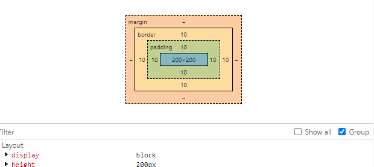
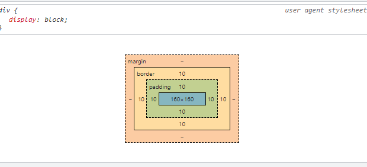
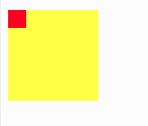
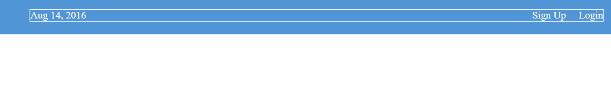

# CSS Introduction

Cascading Style Sheet (CSS) merupakan instruksi penulisan untuk mengatur tata letak dan penampilan dokumen HTML. Dengan adanya bantuan CSS sebagai pengelola tampilan dari dokumen, akan sangat mempermudah penulis menciptakan karyanya.

Beberapa fitur CSS:
1. Mengubah warna text maupun background
1. Mengubah ukuran gambar atau text
1. Membuat animasi atau efek
1. Mengatur penempatan object
1. Memberikan border

## Mengenal CSS Syntax

CSS syntax merujuk pada format aturan dalam pembuatan style. CSS syntax berisi deklarasi, properties, dan selector.

## Cara Menghubungkan CSS dengan Dokumen HTML

Ada tiga cara untuk menghubungkan CSS ke dalam dokumen HTML:

1. Inline Style Sheet
Menulis kode CSS tepat di dalam object yang dituju.
Contoh: `<p style='color:red;'> </p>` 

2. Embedded Style Sheet
Menulis kode CSS di dalam tag HEAD.
Contoh:

```html
<head>
<style>
p {color: red;}
</style>
</head>
```

3. External CSS
Link menuju tempat penyimpanan CSS kita, ditulis di dalam tag `<head>`.
`<link href='style.css' rel='stylesheet'>`

## CSS Property 

```css
p {
    color: red;
}
```

Pada kode di atas, "p" adalah element selector atau disebut selector. Sedangkan "color" adalah property. Property adalah yang memberikan instruksi bagian mana dari selector tersebut yang akan berubah secara visual.

## Mengenai ID

Konsep dari attribute ID sama dengan attribute class, kita dapat melakukan perubahan pada tampilan mereka.

Perbedaan utamanya adalah:
- ID hanya bisa digunakan sekali dalam satu halaman HTML (unique)
- Class bisa digunakan berulang kali
- Jika ada ID dan class yang memiliki style berlawanan, maka style dari ID yang akan dipakai karena ID memiliki prioritas lebih tinggi

Di bawah ini adalah contoh mendefinisikan ID pada CSS dan melakukan pengaturan style:

```css
#div-main {
  background-color: white;
}
```

Cara menggunakan ID di HTML:
```html
<div id="div-main">
  Konten di sini
</div>
```

## Mengenai Padding

Pada pengaturan ukuran element terdapat setidaknya tiga property dasar: padding, border, dan margin.

**Padding** adalah jarak dari content di dalam element ke bagian border.
```css
padding: 1px 1px 1px 1px;
```

**Border** adalah batas luar dari content. Kita dapat melihat border dengan mendefinisikan border ke dalam element tersebut.
```css
border: 1px solid red;
```

**Margin** adalah jarak antara element satu dengan yang lainnya.
```css
margin: 1px 1px 1px 1px;
```

Di bawah ini adalah format untuk value padding dan margin:

```css
padding: 40px 20px 20px 40px;
/* Format penempatan: padding-top, padding-right, padding-bottom, padding-left */
```

Urutan penempatan ini mengikuti arah jarum jam mulai dari atas.

## CSS Selectors

Untuk mempermudah kita dalam melakukan konfigurasi tampilan halaman, kita bisa menggunakan fungsi *CSS Selector*.

Dimana kita sebagai brainware atau developer, cukup mendefinisikan nama element di dalam style CSS, lalu melakukan konfigurasi di sana.

Sebagai perumpamaan:
Terdapat sebuah perumahan yang berisi banyak blok dan setiap blok memiliki aturan pewarnaan bangunan sendiri-sendiri. Sebagai contoh, blok A terdiri dari bangunan yang memiliki dominan warna merah, sedangkan blok B terdiri dari bangunan yang memiliki dominan warna biru.

Di sini pertanyaannya!

Terdapat seorang kurir yang bertanya kepada kita, seperti apa penanda bangunan untuk blok B?

Jawaban:

a. Kita menjawab dengan memberitahu warna dominan pada blok B.
b. Kita menjawab dengan memberitahu blok B berada di dekat blok A.

Penyelesaian:
Jika jawaban kita adalah a, maka itu benar. Karena konsep dari CSS selector adalah menuliskan alamat tujuan dari element yang kita tuju (https://developer.mozilla.org/en-US/docs/Web/CSS/CSS_Selectors?retiredLocale=id).

## Attribute Selector

Attribute selector adalah cara untuk memilih element berdasarkan attribute yang dimilikinya.

```css
/* Ini akan mendefinisikan alamat yang di dalam attribute class terdapat kata "link" */

[class~="link"] {
  margin: 20px 0px 20px 0px;
}
```

Contoh lain attribute selector:
```css
/* Memilih element dengan attribute tertentu */
[href] {
  color: blue;
}

/* Memilih element dengan value attribute spesifik */
[type="text"] {
  border: 1px solid gray;
}
```

## CSS Box Model 

Di dalam sebuah element HTML terdiri dari:
- **Content** adalah area utama dimana jika kita menuliskan suatu text, text tersebut berada di dalam content
- **Padding** adalah area kosong yang menjadi jarak antara content dengan border atau bagian tepi element
- **Border** adalah bagian tepi dari suatu element, berada di antara padding dan margin
- **Margin** adalah bagian luar dari border yang memberi jarak antara element satu dengan yang lainnya


## Box Sizing: Border Box

"box-sizing: border-box" adalah salah satu properti CSS yang dapat digunakan untuk mengatur box model dalam suatu element HTML. Secara simpel, "border-box" digunakan untuk memastikan tinggi dan lebar dari element sesuai dengan keinginan kita.

Cerita:
- Pada dasarnya element akan memiliki tipe "box-sizing: content-box", dimana ukuran element akan dihitung berdasarkan ukuran konten ditambah padding dan border. Sehingga jika kita menambahkan padding atau border, ukuran total element akan membesar.

- Jika "box-sizing: border-box", mereka akan mengatur agar ukuran lebar dan tinggi sesuai dengan spesifikasi yang sudah kita tulis.

Pada dasarnya box model menggunakan perhitungan nilai width x height pada element seperti berikut:

```
Width = width + left padding + right padding + left border + right border

Height = height + top padding + bottom padding + top border + bottom border
```

Sumber: https://medium.com/@elelvyra/learn-css-box-model-dan-box-sizing-6b19a367478d

Mari kita coba untuk membuat box model terlebih dahulu, dengan width 200px, height 200px, padding kanan kiri 10px, padding atas bawah 10px, border kanan kiri 10px, dan border atas bawah 10px.

Mari kita hitung dengan cara di atas:
```
width = 200 + 10 + 10 + 10 + 10 = 240
height = 200 + 10 + 10 + 10 + 10 = 240
```

Total width adalah 240px dan juga height-nya. Ada cara jika kita ingin menghasilkan 200px sebagai keseluruhan dari width dan height, yaitu menambahkan property `box-sizing: border-box;`. **Box sizing** akan mengatur agar lebar atau tinggi dari element tersebut sesuai dengan ukuran width dan height yang sudah ada.

Mari kita lihat ukuran total pada gambar sebelum box sizing.



Jika seandainya kita menambahkan property box sizing seperti kode di bawah:

```css
div.main {
    width: 200px;
    height: 200px;
    background-color: green;
    padding: 10px;
    border: 10px solid black; 
    box-sizing: border-box;
}
```

Intinya:

```css
box-sizing: border-box;
/* berbeda dengan */
box-sizing: content-box;
```

Hasilnya akan menjadi seperti gambar di bawah. `box-sizing: border-box` akan membuat komputer mengatur secara otomatis pembagian dari width dan height untuk membuat hasil total tidak lebih dari yang sudah dideklarasikan.



## CSS Float

Untuk source code bisa dilihat di sini: https://replit.com/@SayaManusia/CSS-Floats#index.html

Float adalah property CSS yang dapat membantu kamu untuk mengatur agar element bisa bergerak secara horizontal. Float tidak hanya untuk mengatur arah gerak element, float akan membuat element di sekitarnya bisa berada di dalam area element float, tidak bergerak di bawah dari element float.

Seperti pada gambar di bawah ini. Kotak kecil berwarna merah memiliki property float, tetapi kotak kuning besar tidak memiliki float. Maka kotak kuning besar akan berjalan di bawah kotak merah.



Ada tiga value float yang sering dipakai:
1. `right` memindahkan element ke kanan
2. `left` memindahkan element ke kiri
3. `none` akan mengubah ke tempat default

Cara penggunaan: `float: left;`

Dan ada tiga cara yang biasanya digunakan untuk memindahkan element:

1. `float: left;` untuk memindahkan ke area kiri
2. `margin: 0 auto;` untuk memindahkan ke area tengah
3. `float: right;` untuk memindahkan ke area kanan

## HTML Document Tree 
http://web.simmons.edu/~grabiner/comm244/weekfour/document-tree.html

Memahami struktur document tree penting untuk memahami bagaimana CSS selector bekerja, terutama saat menggunakan selector yang lebih kompleks seperti child selector atau descendant selector.

## Flexbox

Untuk melihat source code kecil mengenai flexbox: 
[flexbox src](../code/flexbox-test)

Flexbox memiliki kemiripan dengan float, tetapi di sini kita bisa mengatur penuh tata letak element. Mulai dari posisi, urutan, arah garis, dan ukuran dari element.

Untuk memahami penggunaan dari float dan flexbox: Flexbox memiliki fungsi yang lebih lengkap daripada float. Flex akan bisa bekerja jika ada minimal "parent" dan "child" element. Flexbox sangat disarankan jika ingin mengatur bagian yang besar pada website.

Sedangkan float akan dipakai pada element kecil pada halaman website yang tidak memerlukan fungsi kompleks.

Istilah bagian kecil float pada halaman website adalah **Magazine-style layouts**. Istilah bagian besar yang ditangani oleh flexbox adalah **overall page structure**.

Sumber: https://www.internetingishard.com/html-and-css/flexbox/

Pada flexbox ada dua tipe box yang perlu kita pahami, yaitu "flex container" dan "flex items". Element HTML yang ada di dalam element container disebut sebagai item. Kita bisa mengatur setiap item secara individual, tetapi sebagian besar tergantung dengan container untuk mengaturnya bagaimana.

Untuk menggunakan flexbox, kita harus menambahkan property `display: flex;` ke dalam container, karena jika tidak maka semua property flexbox tidak akan dibaca oleh komputer.

Flex container hanya memperhatikan posisi element yang berada di satu level di bawahnya (element di dalam container adalah item). Container tidak akan mengatur element yang berada di dalam item.

Untuk melakukan kustomisasi pada element pada bidang horizontal, kita akan memakai property `justify-content`. Ini akan membantu untuk memindahkan element dan mengatur jarak antar item.

Value yang bisa dipilih pada property justify-content:

- `center` akan membuat element berada di tengah
- `flex-start` akan memindahkan element ke bagian kiri
- `flex-end` akan memindahkan element ke bagian kanan
- `space-between` akan memberikan jarak antar element saja, tidak termasuk border
- `space-around` akan memberikan jarak antar element dan border

Untuk mengelompokkan element pada flexbox, kita cukup buat flexbox lagi di dalam container, seperti kode di bawah ini:

```html
<div class='menu-container'> <!-- This is main container-->
    <div class='menu'> 
        
        <div class='date'>Aug 14, 2016</div>    <!-- main container item -->
        <div class='links'>                     <!-- This is second container -->
            <div class='signup'>Sign Up</div>   <!-- second container item -->
            <div class='login'>Login</div>      <!-- second container item -->
        </div>
    
    </div>
</div>
```



Flexbox juga dapat mengatur pergerakan element dalam bidang vertikal, dengan menggunakan property `align-items`.

Beberapa value yang terdapat pada align-items:

- `center` mengatur posisi item ke tengah
- `flex-start` akan mengatur element ke bagian atas container
- `flex-end` akan mengatur element ke bagian bawah container
- `stretch` akan mengatur element menjadi memanjang ke bawah

## CSS Grid

CSS grid adalah suatu sistem layout dua dimensi pada website, sama seperti flexbox.

Sistem layout design berfungsi untuk mengontrol pergerakan, ukuran, dan penempatan pada element. Dengan CSS grid kita dapat membuat aturan dalam penempatan element di dalam website.

Penggunaan yang baik untuk grid adalah untuk mengatur bagian kecil pada website. Sedangkan element induk yang mencakup element kecil-kecil dikonfigurasi oleh flexbox.

Perbedaan utama:
- **Flexbox** adalah layout satu dimensi (baris atau kolom)
- **Grid** adalah layout dua dimensi (baris dan kolom sekaligus)

Contoh penggunaan grid:
```css
.container {
  display: grid;
  grid-template-columns: 1fr 1fr 1fr; /* 3 kolom dengan lebar sama */
  gap: 10px; /* jarak antar item */
}
```

## CSS Transform dan Transition

Adalah suatu protokol untuk melakukan perubahan secara visual yang terdapat pada element web. Kedua transformasi tersebut melakukan bentuk animasi tanpa harus menggunakan JavaScript.

### CSS Transform
Fungsi ini digunakan untuk memanipulasi bentuk visual dari element, dengan cara mengubah posisi, ukuran, rotasi, dan perspektif. Sebagai contoh, element akan berotasi sesuai dengan berapa derajat yang diinginkan.

Contoh transform:
```css
.box {
  transform: rotate(45deg); /* rotasi 45 derajat */
  transform: scale(1.5); /* memperbesar 1.5x */
  transform: translate(50px, 100px); /* pindah posisi */
}
```

### CSS Transition
Fungsi ini akan membantu dalam melakukan perubahan kondisi dari element. Kamu juga dapat menjelaskan detail seberapa cepat durasi efek, dan sebagainya. Contoh efek transition adalah mengubah ukuran visual dari element.

Contoh transition:
```css
.button {
  background-color: blue;
  transition: background-color 0.3s ease;
}

.button:hover {
  background-color: red; /* perubahan terjadi dalam 0.3 detik */
}
```

Referensi: https://www.w3schools.com/css/css3_transitions.asp

***
# Cheatsheet Area

#### Contoh Kode CSS

```css
p { 
  color: red; 
}
```

- `p` CSS akan mengambil object bernama 'p' dari HTML.
- `color` membuat fungsi untuk memilih warna. Jika tidak ada 'color' maka warna yang dipakai adalah default.
- `red` memilih warna merah.

### CSS Media Query 

Adalah teknologi atau tool yang akan membantu kita membuat skenario khusus pada device tertentu. Media query sangat berguna untuk membuat website responsif yang menyesuaikan tampilannya di berbagai ukuran layar.

Penjelasan:

- `min-width`: Jika yang digunakan adalah ini, maka semua device yang telah melebihi batas minimal akan dilakukan perubahan.

- `max-width`: Jika yang digunakan adalah ini, maka semua device yang lebih kecil dari batas maksimal akan dilakukan perubahan.

- `(min-width) and (max-width)`: Jika yang digunakan adalah ini maka hanya device yang telah melewati batas minimal dan tidak melebihi batas maksimal akan mengalami perubahan.

Contoh kode:

```css
/* Device dengan lebar 400px sampai 500px akan memiliki background ungu */
@media (min-width: 400px) and (max-width: 500px) {
  body {
    background-color: purple;
  }
}

/* Device dengan lebar minimal 400px akan memiliki background merah */
@media (min-width: 400px) {
  body {
    background-color: red;
  }
}

/* Device dengan lebar maksimal 600px akan memiliki background ungu */
@media (max-width: 600px) {
  body {
    background-color: purple;
  }
}
```

Contoh breakpoint umum untuk responsive design:
```css
/* Mobile devices */
@media (max-width: 480px) {
  /* CSS untuk mobile */
}

/* Tablets */
@media (min-width: 481px) and (max-width: 768px) {
  /* CSS untuk tablet */
}

/* Desktop */
@media (min-width: 769px) {
  /* CSS untuk desktop */
}
```

#### Referensi
- https://id.wikipedia.org/wiki/Cascading_Style_Sheets
- https://www.w3schools.com/css/css_howto.asp
- https://www.freecodecamp.org/
- https://css-tricks.com/a-complete-guide-to-css-media-queries/ (media query)
