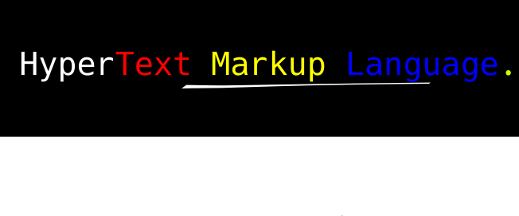

## Pengenalan



HTML (HyperText Markup Language) adalah instruksi untuk menulis dokumen agar bisa ditampilkan ke dalam web browser. Web browser akan mengambil file HTML dari penyimpanan lokal dan mengubahnya menjadi halaman website.

Dalam pembuatan website terdapat setidaknya 3 komponen pembangun:

- Kerangka tubuh: HTML
- Fungsi Tubuh: JavaScript
- Bagian paling luar tubuh: CSS

Secara garis besar kita bisa bayangkan HTML sebagai bagian yang menjadi penopang dari text dan gambar, JavaScript adalah bagian yang menghasilkan respons terhadap sesuatu, dan CSS adalah bagian yang mengatur tampilan mereka.

## Agar Dapat Menguasai 

Dalam penggunaan HTML dan CSS, ada opsi untuk menggunakan framework agar mempercepat proses pembuatan website. Bagi yang baru mulai belajar, diharapkan jangan terlalu mengandalkan framework karena itu akan menghasilkan kebiasaan buruk dalam problem solving (Programming Unpas).

Contoh mudahnya: dalam matematika ada banyak trik cepat untuk menyelesaikan masalah. Tapi itu kurang baik karena kalau ketemu masalah yang berbeda, akan sulit untuk mengatasinya nanti.

Bagi yang masih belum tahu apa itu framework, framework adalah bentuk fondasi yang sudah jadi dalam membangun sistem. Dengan framework kita tidak perlu membangun sistem sepenuhnya dari awal (https://www.codecademy.com/resources/blog/what-is-a-framework/#:~:text=A%20framework%20is%20a%20structure,you%27re%20building%20a%20house.).

Selain itu kita juga harus berani mencoba dan berlatih dalam pembuatan website. Kesalahan dalam berusaha adalah hal yang wajar, tidak ada yang bisa lari dari itu. Oleh karena itu, kalau ingin menguasai pembuatan website, kamu harus berani mencoba.

## Peralatan Membantu

Dalam pemrograman website diperlukan alat untuk membantu proses pembuatan. Alat tersebut terkadang berbentuk hardware maupun software.

Tapi yang perlu kita pahami adalah sebuah alat hanyalah alat. Yang terpenting adalah brainware yang menggunakan alat tersebut.

Contoh software yang sering digunakan:
- VSCode
- Atom Text Editor
- Notepad++

Software Browser:
- Google Chrome
- Opera
- Mozilla Firefox

Hardware Pendukung:
- Monitor dengan minimal resolusi 1920 x 1080
- 2 Monitor untuk mempermudah pengerjaan

Dalam pengerjaan halaman website, alangkah baiknya untuk membuka halaman website dan text editor secara bersamaan. Setiap kali kita melakukan perubahan bisa langsung dilihat hasilnya di web browser.

## Struktur HTML

Dalam pembuatan halaman website, ada struktur yang paling populer digunakan.

SRC: https://developer.mozilla.org/en-US/docs/Learn/HTML/Introduction_to_HTML/Document_and_website_structure

- Header:
Header adalah bagian yang berada di tempat paling atas dokumen. Biasanya berisi logo dan menu navigasi.

- Navigation Bar: 
Navigation bar adalah bagian yang berfungsi sebagai peta petunjuk pada website. Biasanya berbentuk menu yang menyediakan fitur dan layanan website tersebut.

- Main Content: 
Main content adalah bagian paling penting dalam sebuah website, berisi mengenai layanan atau topik yang dibahas pada website tersebut. 

Sebagai contoh: pada YouTube, main content adalah bagian dimana kita melihat video yang sedang berjalan.

- Sidebar:
Sidebar adalah bagian yang berisi informasi tambahan ataupun pilihan layanan lainnya. Biasanya sidebar berada di sebelah main content.

Sebagai contoh: pada YouTube, sidebar adalah bagian samping video yang berisi pilihan video lainnya yang bisa kita tonton.

- Footer:
Footer biasanya berupa bagian paling bawah di dalam halaman website. Footer berisi mengenai informasi kepemilikan dan informasi kontak dari pemilik website.

## Table pada HTML

NIM | Name | Major
--- | ---  | --- 
0123 | Rangga | Bahasa Inggris
0124 | Wahyu | Sistem Informasi
0125 | Atmoko | Pendidikan Matematika

Di atas adalah contoh dari table. Di dalam table terdapat kolom dan baris.

Kolom adalah bagian content yang vertikal dari atas ke bawah. Contoh: NIM, Name, Major.

Baris adalah bagian content yang horizontal lurus ke kanan. Contoh: Rangga, Wahyu, Atmoko.

Contoh kode table pada HTML:

```html
<table>
    <tr> 
        <td> NIM </td>
        <td> Name </td>
        <td> Major </td>
    </tr>

    <tr>
        <td> 0123 </td>
        <td> Rangga </td>
        <td> Bahasa Inggris </td>
    </tr>

    <tr> 
        <td> 0124 </td>
        <td> Wahyu </td>
        <td> Sistem Informasi </td>
    </tr>

    <tr> 
        <td> 0125 </td>
        <td> Atmoko </td>
        <td> Pendidikan Matematika </td>
    </tr>
</table>
```

## Form pada HTML

Form pada HTML adalah elemen yang digunakan untuk mengumpulkan input dari pengguna. Form sangat berguna untuk membuat halaman registrasi, login, atau pengisian data lainnya.

Elemen dasar form:
- `<form>` sebagai container utama
- `<input>` untuk berbagai jenis input
- `<textarea>` untuk input text yang lebih panjang
- `<button>` untuk tombol submit atau aksi lainnya
- `<select>` untuk dropdown menu
- `<label>` untuk memberikan label pada input

Contoh form sederhana:
```html
<form action="/submit" method="post">
    <label for="nama">Nama:</label>
    <input type="text" id="nama" name="nama">
    
    <label for="email">Email:</label>
    <input type="email" id="email" name="email">
    
    <button type="submit">Kirim</button>
</form>
```

## Pentingnya Semantic pada HTML

Semantic element pada HTML digunakan untuk memberikan makna pada content yang dimiliki. Fungsi utamanya adalah untuk memberi tahu developer dan user tentang pemahaman lebih mengenai fungsi content dan tujuannya. Selain itu, semantic pada website dapat meningkatkan hasil Search Engine Optimization (SEO).

Contoh Element Semantic https://www.petanikode.com/html-semantik/:
- `<article>` untuk konten artikel
- `<aside>` untuk konten sampingan
- `<details>` untuk detail tambahan
- `<figcaption>` untuk caption gambar
- `<figure>` untuk ilustrasi atau diagram
- `<footer>` untuk bagian footer
- `<main>` untuk konten utama
- `<nav>` untuk navigasi

Menggunakan semantic element membuat struktur HTML lebih jelas dan mudah dipahami, baik oleh developer maupun search engine.

## Proses Pembuatan 

Fitur HTML:
1. Menulis text
1. Memberikan ukuran dan ketebalan pada text
1. Membuat table
1. Menambahkan gambar 
1. Menambahkan pranala (lebih kita kenal dengan embedded link)
1. Menambahkan data suara
1. Menambahkan form yang dapat diisi

##### Contoh source code HTML 
```html
<!doctype html>
<html lang="en">
<head>
  <title>Homepage</title>
</head>
<body>
  <p>Hello, World!</p>
</body>
</html>
```

Mari kita pahami sedikit:
- `<!doctype html>` ini bukan HTML tag, tapi dibutuhkan untuk memberi informasi kepada web browser tentang tipe dokumen ini.
- `<html lang='en'>` Ini untuk membantu mesin pencari dan web browser dalam mengelola bahasa. Untuk informasi lebih banyak: https://www.w3schools.com/tags/ref_language_codes.asp
- `<head> </head>` Data yang biasanya berada di dalamnya adalah title, CSS source code, JavaScript source code, META data, data font style, dan lain-lain.
- `<body> </body>` Tag ini digunakan untuk menyimpan informasi atau data sebelum diolah menjadi halaman website.
- `<p> </p>` Tag ini digunakan untuk menulis paragraf biasa di dalam dokumen.

## Apa itu HTML Element?

HTML element dimulai dari tag pertama, beberapa content, dan diakhiri dengan tag penutup. HTML **element** adalah semua yang berada dari tag pembuka hingga tag penutup.

**Nested HTML Element** adalah sebuah element yang memiliki element lain di dalamnya. 

Contoh: 
```html
<body>
    <h1>My First Heading</h1>
    <p>My first paragraph.</p>
</body>
```

> Untuk beberapa element, terkadang disebut sebagai empty element seperti `<br>` karena tidak memiliki content dan tag penutup.

HTML tidak melakukan "Case Sensitive". Kamu bisa menggunakan huruf besar atau kecil sesuka hati, tetapi usahakan untuk konsisten agar kode terlihat rapi.

Pada struktur page HTML, semua yang berada di dalam `<body>` akan ditampilkan pada halaman browser. Sedangkan semua content yang berada di dalam element `<title>` akan muncul pada browser title bar.

## HTML Attribute

Semua element HTML bisa memiliki attribute untuk memberikan instruksi tambahan atau informasi tambahan.
- Attribute selalu ditambahkan pada tag pembuka
- Attribute biasanya berformat `attribute_name = "value"`

Contoh attribute pada HTML:
```html

```

Dalam SRC secara online, URL memiliki dua tipe:
- Absolute URL adalah link yang didapatkan dari platform hosted atau website yang bukan milik kita. Contoh: menggunakan link gambar yang berada di Wikipedia untuk menjadi sampul halaman website Blogspot.
- Relative URL adalah link ke image atau data yang sudah ada di dalam website kita sendiri.

#### Breakdown Struktur Link
``` https://github.com/playmakermz/warkop-website/blob/main/document/html.md ```

- Schema: "https://"
- Domain: "github.com"
- Path: "/playmakermz/warkop-website/blob/main/document/html.md"

## Penggunaan CSS

Ada tiga cara untuk menggunakan CSS pada HTML:
- **Inline** dengan menggunakan `style` attribute di dalam element HTML
- **Internal** dengan menggunakan element `<style>` di dalam `<head>`
- **External** dengan menggunakan element `<link>` pada `<head>` untuk merujuk ke file CSS terpisah

```html
<!DOCTYPE html>
<html>
<head>
  <link rel="stylesheet" href="styles.css"> <!-- External CSS -->

  <style> <!-- Internal CSS -->
    body {background-color: powderblue;}
    h1   {color: blue;}
    p    {color: red;}
  </style>

</head>
<body>

<h1 style="color:blue;">This is a heading</h1> <!-- Inline CSS-->
<p>This is a paragraph.</p>

</body>
</html>
```

## Border 

Border adalah bagian tepi dari element. Dengan menggunakan property border kita bisa menampilkan garis tepi element dan melakukan perubahan pada tampilan border.

```css
border: 1px solid red;
```

Penjelasan:
- `1px` adalah ketebalan garis
- `solid` adalah tipe garis (bisa juga `dashed`, `dotted`, dll)
- `red` adalah warna border

## HTML Block dan Inline Element

Pada HTML terdapat berbagai macam display value. Kita akan melihat yang paling sering digunakan yaitu: Block dan Inline.

**Block Level Elements**

Block level element akan selalu membuat baris baru setelah kita deklarasikan. Block level element akan mengambil penuh width atau lebar yang tersedia. Ketinggian border dari block level element berdasarkan content yang dimiliki. Contoh dari block level element: `<p>` dan `<div>`.

**Inline Elements**

Inline element tidak akan membuat baris baru seperti block level. Lebar dari inline element akan sama dengan content yang ada di dalamnya. Oleh karena itu kita tidak bisa mengatur **width dan height** dari element yang memiliki display inline. Contoh inline element: `<em>`, `<span>`, dan `<strong>`.

**Inline Block**

Selain block dan inline, ada juga inline block. Element yang memiliki display inline block bisa kita atur "width" dan "height"nya. Secara mudahnya ini adalah penggabungan antara block dan inline.

**Display: None**

Jika kita menambahkan property ini pada element, maka element tersebut akan menghilang dari halaman website.

## Pohon Keluarga pada Dokumen HTML

Pada pembuatan halaman website, penting untuk memahami struktur pohon keluarga dokumen.

Konsep ini sangat penting untuk mempermudah kita menyusun kerangka HTML yang lebih kompleks (http://web.simmons.edu/~grabiner/comm244/weekfour/document-tree.html).

```html
<body>

<div id="content"> <!-- parent -->
    <ul>  <!-- child -->
        <li> item 1 </li> <!-- sibling dari satu parent -->
        <li> item 2 </li> <!-- sibling -->
    </ul>
</div>
```

Dalam contoh di atas:
- `<div id="content">` adalah parent (orang tua)
- `<ul>` adalah child (anak) dari div
- `<li>` adalah child dari ul dan sibling (saudara kandung) satu sama lain

***
# CheatSheet Area 

## Penulisan Unordered List

Dengan menggunakan element `<ul>` sebagai container dan element `<li>` sebagai item, kita bisa membuat unordered list sama seperti yang ada di Microsoft Word.

```html
<h1> Judul </h1>

<ul>
    <li> List item 1 </li> 
    <li> List item 2 </li>
</ul>
```

## Penulisan Ordered List 

Dengan penulisan berurut, kita bisa membuat list dengan angka secara otomatis.

`<ol>` adalah sebagai container dan `<li>` sebagai element untuk item.

```html
<h1> Judul </h1>

<ol>
    <li> Item 1 </li>
    <li> Item 2 </li>
</ol>
```

## Font Style 

- Menulis dengan huruf tebal
    ```html
    <strong> Text akan lebih tebal </strong>
    ```

- Menulis huruf miring
    ```html
    <i> Huruf garis miring </i>
    ```
    
- Menulis paragraf 
    ```html
    <p> Ini adalah paragraf </p>
    ```
    
- Menulis judul atau heading
    ```html
    <h1> Judul terbesar </h1>
    <h2> Judul kedua </h2>
    ```
    
- Garis horizontal
    ```html
    <hr/>
    <!-- Atau tanpa menggunakan garis miring -->
    <hr>
    ```

## Element CheatSheet

Tag | Element | Description
--- | --- | --- 
h1 - h6 | `<h1> judul </h1>` | Heading 
p | `<p> paragraf </p>` | Paragraph
a | `<a href="#">Link</a>` | Link atau hyperlink
img | `` | Image 
hr | `<hr>` | Horizontal Rule, memberikan garis lurus secara horizontal
br | `<br>` | Sebagai line break atau pindah baris
pre | `<pre> this is line </pre>` | Akan menghasilkan fixed text, sama persis dengan content di dalamnya. Jarak tulisan tidak akan diatur oleh browser

## Menambahkan Gambar pada Dokumen

Gambar berformat adalah object yang berada di luar dokumen. Untuk menambahkan gambar ke dokumen, kita bisa panggil mereka melalui path yang tepat. Path bisa berasal dari internal source ataupun external source.

Contoh menambahkan gambar dari sumber internal:
```html
<!--  -->


<!-- Atau mendefinisikan lebar default -->


<!-- Text pengganti gambar jika gambar tidak berhasil di-render -->

```

Pada dasarnya, jika kita memanggil gambar, ukuran tinggi dan panjang akan diambil dari sumber aslinya.

## Attribute CheatSheet

Attribute | Description 
--- | --- 
`href="#"` | Digunakan untuk menambahkan hyperlink atau path ke sumber tujuan
`src="#"`  | Digunakan untuk memberi tahu hyperlink atau path yang menuju sumber gambar
`width="#"` | Menunjukkan ukuran lebar
`height="#"` | Menunjukkan ukuran tinggi
`alt="this is text"` | Biasanya digunakan untuk element "img", jika gambar gagal dimunculkan text ini akan muncul 
`style="#"` | Digunakan untuk menambahkan style pada element dengan CSS 
`title="this is title"` | Ini akan memunculkan pop-up kecil saat kamu mengarahkan mouse ke element tersebut
`class="class_name"` | Ini adalah untuk pengelompokan agar bisa diberi instruksi dari CSS ke element tersebut
`id="id_name"` | Ini adalah pengelompokan untuk diberi instruksi dari CSS ke element tersebut, dan juga hyperlink 

## Menghubungkan File CSS dengan Dokumen HTML

Masuk ke file latihan HTML 01 di repository ini: [Panduan menghubungkan dokumen dan CSS](../latihan/html01.md)

> Selamat telah menyelesaikan dasar HTML!
> Materi selanjutnya akan kita bahas pada bagian CSS.
> Klik untuk lanjut ke halaman [CSS](../document/css.md)

***
# Latihan HTML

- Menghubungkan file CSS ke dalam dokumen HTML [Latihan 1 HTML](../latihan/html01.md)
- Membuat halaman website berisi puisi [Latihan Puisi](../latihan/lt-puisi.md)
- Latihan Float [Latihan Float](../latihan/lt-float.md)
- Membuat standar template website [Latihan Standar](../latihan/lt-standart-web.md)
- Latihan penggunaan box model [Latihan 2 HTML](../latihan/html02.md)
- Membuat website dengan grid [Latihan 3](../latihan/lt-grid.md)
- Membuat website dengan Flexbox [Flexbox](../latihan/lt-flexbox.md)
- Contoh CSS position [Contoh CSS](../latihan/lt-css-position.md)
- Membuat landing page website makanan
- Membuat portofolio pribadi

#### Referensi 
- https://id.wikipedia.org/wiki/HTML
- https://www.w3schools.com/tags/tag_doctype.asp
- https://id.wikipedia.org/wiki/Pranala
- https://html.spec.whatwg.org/multipage/introduction.html#introduction
- https://github.com/jgthms/web-design-in-4-minutes
- https://github.com/jgthms/marksheet
- https://www.internetingishard.com/
- https://github.com/Asabeneh/30-Days-Of-HTML
- https://www.w3schools.com/html/
- https://www.freecodecamp.org/news/the-css-display-property-display-none-display-table-inline-block-and-more/ 
- https://www.internetingishard.com/html-and-css/css-box-model/
- https://www.internetingishard.com/html-and-css/
- https://bigshans.github.io/post/css-box/ [CSS box model]
