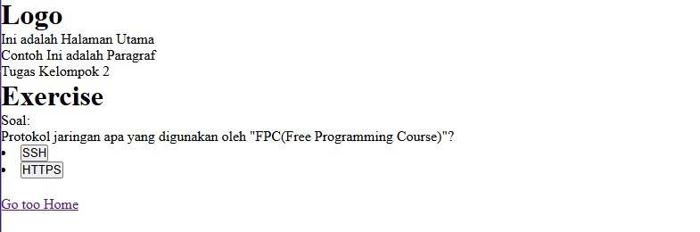

# Membuat Komponent Kuis tanya jawab

Pembuatan komponen kuis akan menggunaakan VUE JS

Hasil akhir akan seperti ini:


## Tahapan pengerjaan
1. Menyiapkan wadah komponent dasar
```html
<script setup>
// ======================================== Script area start =======================================================


// ======================================== Script area End =======================================================
</script>


<template>
<!-- 0000000000000000000000000000000000000000000000000000000 Template Area start 0000000000000000000000000000000000000000-->


<!-- biarkan code dibawah ini -->
<nav>
    <RouterLink to="/">Go to Home</RouterLink>
</nav>
<!-- 000000000000000000000000000000000000000000000000000000 Template area end  000000000000000000000000000000000000000000 -->
</template>


<style scoped>

/* ============================================== Style area start ======================================= */


/* ============================================== Style area end ======================================= */
</style>
```

2. 
Import Package pendukung

`import { ref } from 'vue'`

3. Buat State sebagai representasi dari setiap jawaban yang ada

Semisal disini ada dua jawaban dari soal kita, maka harus ada dua state boolean jawaban.

```javascript

const kuisTr = ref(false) // adalah state note True | Tr(True) | Penempatan: Jawaban Atas(True)
const kuisFl = ref(false) // adalah state note false | Fl(False) | Penempatan: Jawaban bawah(False)
```

4. Siapkan fungsi onclick

dimana disaat button di tekan oleh user, maka function akan  dijalankan. Fungsi disini adalah untuk membalikan nilai boolean

```r
// Menimpa nilai awal menjadi nilai baru
function SkuisTr(){ // Ini untuk buka catatan kuis True | Skuis(Soal kuis)
  kuisTr.value = !kuisTr.value
  kuisFl.value = false
}

// Menimpa nilai awal menjadi nilai baru
function SkuisFl(){ // Ini untuk buka catatan kuis False
  kuisFl.value = !kuisFl.value
  kuisTr.value = false
}
```

5. Menyiapkan component html kecil yang siap dipakai

dimana component ini akan kita panggil jika fungsi button di tekan

```
let JawA = ref(`
<div class="">
<h3>HTTPS</h3>
<p>HTTPS memiliki cara kerja yang hampir sama dengan HTTP, perbedaan adalah disana terdapat enkripsi TLS ( Transport Layer Security )tambah untuk meningkatkan keamanan jaringan. Penambahan kemanan salah satunnya berada di sisi server
  </p>
</div>
`) // JawA(Jawaban A)

const JawB = ref(`
  <div class="alert">
    <h3>Contoh HTML</h3>
    <p>Ini HTML dari script setup!</p>
  </div>
`);// JawaB(Jawaban B)
```

6. Pada bagian "template" persiapkan soal

contoh:
```html

<h1>Exercise</h1>

<p>Soal: </p>
<p>Protokol jaringan apa yang digunakan oleh "FPC(Free Programming Course)"?</p>

```

7. Persiapkan jawaban pilihan ganda

```html
<lu>
  <li><button @click="SkuisTr">SSH</button></li>
  <li><button @click="SkuisFl">HTTPS</button></li>
</lu>

```

8. Gunakan state boolean tadi sebagai fondasi dalam mebuat "Note" penjelasan atas pilihan ganda yang dia pilih

```html
<div v-if="kuisTr">
  <div v-html="JawA"></div>
</div>

<div v-if="kuisFl">
  <div v-html="JawB"></div>
</div>
```

9. selesai. Dibawah ini adalah contoh hasil jadi komplit

```html
<script setup>
import { ref } from 'vue'

const kuisTr = ref(false) // adalah state note True | Tr(True) | Penempatan: Jawaban Atas(True)
const kuisFl = ref(false) // adalah state note false | Fl(False) | Penempatan: Jawaban bawah(False)

// Menimpa nilai awal menjadi nilai baru
function SkuisTr(){ // Ini untuk buka catatan kuis True | Skuis(Soal kuis)
  kuisTr.value = !kuisTr.value
  kuisFl.value = false
}

// Menimpa nilai awal menjadi nilai baru
function SkuisFl(){ // Ini untuk buka catatan kuis False
  kuisFl.value = !kuisFl.value
  kuisTr.value = false
}


// Membuat component kecil untuk HTML


let JawA = ref(`
<div class="">
<h3>HTTPS</h3>
<p>HTTPS memiliki cara kerja yang hampir sama dengan HTTP, perbedaan adalah disana terdapat enkripsi TLS ( Transport Layer Security )tambah untuk meningkatkan keamanan jaringan. Penambahan kemanan salah satunnya berada di sisi server
  </p>
</div>
`) // JawA(Jawaban A)

const JawB = ref(`
  <div class="alert">
    <h3>Contoh HTML</h3>
    <p>Ini HTML dari script setup!</p>
  </div>
`);// JawaB(Jawaban B)
</script>


<template>
<!-- ======================= Awal  dari Template ======================= -->

<h1>Exercise</h1>

<p>Soal: </p>
<p>Protokol jaringan apa yang digunakan oleh "FPC(Free Programming Course)"?</p>


<lu>
  <li><button @click="SkuisTr">SSH</button></li>
  <li><button @click="SkuisFl">HTTPS</button></li>
</lu>


<div v-if="kuisTr">
  <div v-html="JawA"></div>
</div>

<div v-if="kuisFl">
  <div v-html="JawB"></div>
</div>


<!-- ======================= Akhir dari Template ======================= -->
</template>


<style scoped>

.read-the-docs {

  color: #888;

}

</style>
```