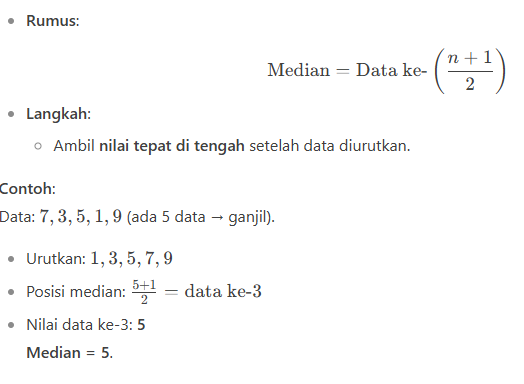
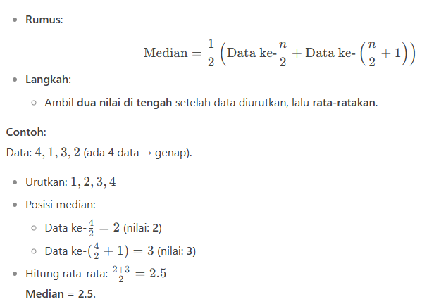
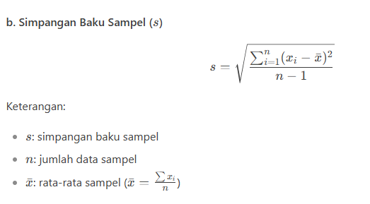
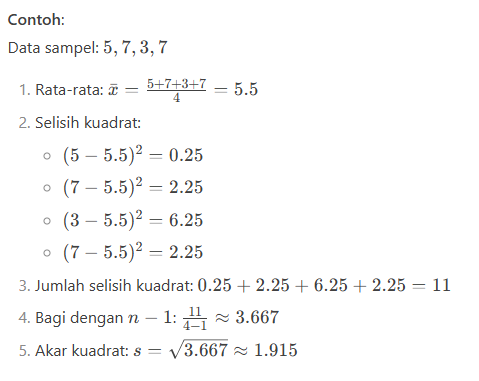
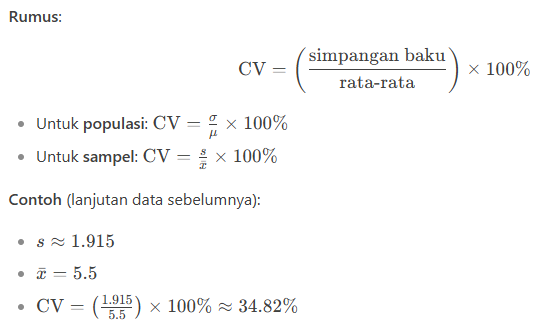

# R untukk Analisis Data

## kajian Pustaka sederhana

### a. Metode Statistika

Pada metode statistika terdapat klasifikasi 2 kelompok yaitu: Statistika Deskriptif dan statistika infersia.
1. statistika Deskriptif, adalah 
2. statistika infersia

### b. statistika deskriptif

secara umum dibagi menjadi dua bagian penting yaitu: ukuran pemusatan(nilai tengah) data dan ukuran penyebaran data. "nilai tengah" adalah sebuah gambaran kesimpulan informasi yang akan memberitau kita atas rata-rata, median, dan modus pada kumpulan data. Ukuran yang termasuk pada data statisika:
1. rata-rata, adalah jumlah semua data yang dibagi dengan banyak data.
2. Media, adalah membagi data yang telah diurut menjadi dua bagian yang saqma. `n` adalah total berapa jumlah data. `x` adalah variabel representasi untuk median.
- Median ganjil: 

- median genap: 

3. Modus, adalah nilai yang sering muncul.


"ukuran penyebaran data" adalah informasi yang akan memberitau kita atas selisis ataupun penyimpangan pada suatu nilai data terhadap nilai rata-rata. Beberapa macam perhitungan "ukuran penyebaran data" adalah jangkauan, keragaman, simpangan baku, dan koefisiensi keragaman. 

### c. Ukuran penyebaran data

Ukuran penyebaran data disini berfungsi untuk membantu kita mengetahui penyebaran data dari rata-rata mereka. Pendekatan ukuran penyebaran data adalah sebagai berikut:

1. Jangkauan, adalah selisih antara data tertinggi dan data terendah. Cukup lakukan perhitungah aritmatika sederhana dengan cara kurangi nilai tinggi dan rendah `x_tinggi - x_rendah`
2. Keragaman, adalah menghitung keseluruhan data dan menunjukan nilai deviasi. Ukuran keragaman didasarkan oleh perbedaan anatara suatu nilai pada data dengan nilai rata-rata mereka.


3. Koefisien Keragaman, adalah menghitung nilai relatif standart deviasi terhadaap nilai rata-rata. 



### d. Bentuk-bentuk Penyajian data

Ini adalah protokol untuk menyajikan data yang ada agar dapat dengan mudah dipahami oleh pembaca. Beberapa bentuk penyajian yang ada adalah:

1. Tabel
2. Grafik, Model grafik ini akan sangat membantu dalam menyajikan informasi pada data dengan sangat effisien. Seperti Grafik line(untuk pasar saham), grafik peta, dll
3. Peta, Model grafik ini tidak berfokus kepada unsur design layout menarik seperti tabel, melainkan fokus pada menjabarkan konsep pembagian. Contohnya seperti model flowchart, dan sebagainnya.

### e. Membandingkan kelompok data

Ukuran nilai untuk membandingkan kelompok data adalah "ukuran penyebaran data". Ukuran penyebaran data digunakan untuk mengetahui penyebaran nilai dari rata-rata. Semakin kecil "nilai penyebaran" maka dapat dipastikan populasi data juga kecil, dan ini berlaku sebalinnya. 


### f. Transformasi data 
itu artinya kita akan mengubah skala bentuk pengukuran data menjadi bentuk yang lain agar sebaran data menjadi normal. dimana pada *Heteroskedastisitas* itu berarti data tidak homogen.

**1. ciri-ciri distribusi normal**


**Contoh:**


### g. Transformasi y* = ln(y) dan x* = ln(y)

Transformasi ini ada untuk melakukan stabilitas pada varians dan mengurangi grafik penceng ke kanan.

**Contoh hasil transformasi y**


Rumus Transformasi pada R:
```R
# Rumus Transformasi pada R
log(y)

# atau
# log(x)
# untuk nilai x
```

### h. Standart deviasi(SD)

adalah nilai yang akan menjadi representasi dari pesebaran data pada sampel. SD juga bisa menjadi acuan untuk melihat seberapa dekat data dengan nilai mean. Semakin banyak variasi data, semakin tinggi pula SD.

### i Membuat scatter plot dan regresi linear

Pada R, untuk melakukan regresi linear cukup dengan `lm(namaKolomA ~ namaKolomB, data= datasetName)`

```R
# Data Kecepatan dan jarak pada tabel
jarak <- c(2,10,4,20,17,13,18,28,33,18,26,12,24,22,28,24,32,34,43,24,30,58,80,20,24,55,35,40,30,44,50,46,53,70,80,36,46,68,34,48,50,56,60,64,56,72,90,92,110,85)
banyak2 <- length(jarak)

kecepatan <- c(4,4,7,7,8,8,9,10,10,11,11,12,12,12,13,13,13,13,114,14,14,14,15,15,15,16,16,17,17,17,17,17,18,18,18,19,19,20,20,20,20,20,21,22,23,24,24,24,25,25)
banyak1 <- length(kecepatan)

# Membuat scatter plot
plot(jarak, kecepatan, 
     main = "Scatter Plot : Kecepatan vs Jarak",  # Judul
     xlab = "Kecepatan (km/h)", # sumbu x
     ylab = "Jarak (meter)",  # sumbu y
     pch = 19, # Bentuk titik 
     col = "blue") # warna titik


# Garis tren merah (regresi linear)
model <- lm(kecepatan ~ jarak)
abline(model, col = "red", lwd = 2)

```

### j. Mekanisme data hilang
1. Missing Completelty at random(MCAR). Adalah kejadian data hilang secara acak.
2. Missing at random (MAR ). Data hilang memiliki pattern yang jelas, dan dapat dicari tau dan di tanggulangi dengan baik.
3. Missing not at random (MNAR ). data hilang disebabkan kejadian atau materi yang tidak diukur.

Tabel mengenai ringkasan kelebihan dan kelemahan setiap metode untuk penanngan data hilang.
No | Metode | Kelebihan | Kelemahan
--- | --- | --- | ---
1 |Listwise or case deletion | Metode sederhana. Cukup hapus baris yang memiliki kehilangan data | Mengurangi detail informasi pada data
2 | Pairwise deletion(penghapusan berpasangan) | Informasi pada data analisis lebih banyak daripada yang dihapus | Variabel akan menhasilkan statistik yang berbeda
3 | Mean Substitution | Dapat membantu pada mekanisme hilang seperti: MAR dan MCAR | metode ini dapat menghasilkan bias, jika nilai hilang tidak acak.
4 | Regression imputation | Dapat membantu pada mekanisme hilang seperti: MAR | 
### k. 

### l

### m

### n

### o

### p

### q

### r

### s

### t

### u

### v

### w


## Referensi
- BMP MSIM4310 Prinsip dasar penyajian data


