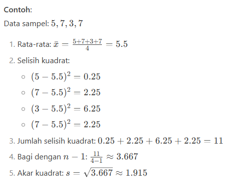

# R untukk Analisis Data

## catatan pustaka

### a. Metode Statistika

Pada metode statistika terdapat klasifikasi 2 kelompok yaitu: Statistika Deskriptif dan statistika infersia.
1. statistika Deskriptif, adalah 
2. statistika infersia

### b. statistika deskriptif

secara umum dibagi menjadi dua bagian penting yaitu: ukuran pemusatan(nilai tengah) data dan ukuran penyebaran data. "nilai tengah" adalah sebuah gambaran kesimpulan informasi yang akan memberitau kita atas rata-rata, median, dan modus pada kumpulan data. Ukuran yang termasuk pada data statisika:
1. rata-rata, adalah jumlah semua data yang dibagi dengan banyak data.
2. Media, adalah membagi data yang telah diurut menjadi dua bagian yang saqma. `n` adalah total berapa jumlah data. `x` adalah variabel representasi untuk median.
- Median ganjil: 

- median genap: 

3. Modus, adalah nilai yang sering muncul.


"ukuran penyebaran data" adalah informasi yang akan memberitau kita atas selisis ataupun penyimpangan pada suatu nilai data terhadap nilai rata-rata. Beberapa macam perhitungan "ukuran penyebaran data" adalah jangkauan, keragaman, simpangan baku, dan koefisiensi keragaman. 

### c. Ukuran penyebaran data

Ukuran penyebaran data disini berfungsi untuk membantu kita mengetahui penyebaran data dari rata-rata mereka. Pendekatan ukuran penyebaran data adalah sebagai berikut:

1. Jangkauan, adalah selisih antara data tertinggi dan data terendah. Cukup lakukan perhitungah aritmatika sederhana dengan cara kurangi nilai tinggi dan rendah `x_tinggi - x_rendah`
2. Keragaman, adalah menghitung keseluruhan data dan menunjukan nilai deviasi. Ukuran keragaman didasarkan oleh perbedaan anatara suatu nilai pada data dengan nilai rata-rata mereka.


3. Koefisien Keragaman, adalah menghitung nilai relatif standart deviasi terhadaap nilai rata-rata. 


### d. Bentuk-bentuk Penyajian data

Ini adalah protokol untuk menyajikan data yang ada agar dapat dengan mudah dipahami oleh pembaca. Beberapa bentuk penyajian yang ada adalah:

1. Tabel
2. Grafik, Model grafik ini akan sangat membantu dalam menyajikan informasi pada data dengan sangat effisien. Seperti Grafik line(untuk pasar saham), grafik peta, dll
3. Peta, Model grafik ini tidak berfokus kepada unsur design layout menarik seperti tabel, melainkan fokus pada menjabarkan konsep pembagian. Contohnya seperti model flowchart, dan sebagainnya.

### e. Membandingkan kelompok data

Ukuran nilai untuk membandingkan kelompok data adalah "ukuran penyebaran data". Ukuran penyebaran data digunakan untuk mengetahui penyebaran nilai dari rata-rata. Semakin kecil "nilai penyebaran" maka dapat dipastikan populasi data juga kecil, dan ini berlaku sebalinnya. 


### f. Transformasi data 
itu artinya kita akan mengubah skala bentuk pengukuran data menjadi bentuk yang lain agar sebaran data menjadi normal. dimana pada *Heteroskedastisitas* itu berarti data tidak homogen.

**1. ciri-ciri distribusi normal**


**Contoh:**


### g. Transformasi y* = ln(y) dan x* = ln(y)

Transformasi ini ada untuk melakukan stabilitas pada varians dan mengurangi grafik penceng ke kanan.

**Contoh hasil transformasi y**


Rumus Transformasi pada R:
```R
# Rumus Transformasi pada R
log(y)

# atau
# log(x)
# untuk nilai x
```

### h. Standart deviasi(SD)

adalah nilai yang akan menjadi representasi dari pesebaran data pada sampel. SD juga bisa menjadi acuan untuk melihat seberapa dekat data dengan nilai mean. Semakin banyak variasi data, semakin tinggi pula SD.

### i Membuat scatter plot dan regresi linear

Pada R, untuk melakukan regresi linear cukup dengan `lm(namaKolomA ~ namaKolomB, data= datasetName)`

```R
# Data Kecepatan dan jarak pada tabel
jarak <- c(2,10,4,20,17,13,18,28,33,18,26,12,24,22,28,24,32,34,43,24,30,58,80,20,24,55,35,40,30,44,50,46,53,70,80,36,46,68,34,48,50,56,60,64,56,72,90,92,110,85)
banyak2 <- length(jarak)

kecepatan <- c(4,4,7,7,8,8,9,10,10,11,11,12,12,12,13,13,13,13,114,14,14,14,15,15,15,16,16,17,17,17,17,17,18,18,18,19,19,20,20,20,20,20,21,22,23,24,24,24,25,25)
banyak1 <- length(kecepatan)

# Membuat scatter plot
plot(jarak, kecepatan, 
     main = "Scatter Plot : Kecepatan vs Jarak",  # Judul
     xlab = "Kecepatan (km/h)", # sumbu x
     ylab = "Jarak (meter)",  # sumbu y
     pch = 19, # Bentuk titik 
     col = "blue") # warna titik


# Garis tren merah (regresi linear)
model <- lm(kecepatan ~ jarak)
abline(model, col = "red", lwd = 2)

```

### j. Mekanisme data hilang
1. Missing Completelty at random(MCAR). Adalah kejadian data hilang secara acak.
2. Missing at random (MAR ). Data hilang memiliki pattern yang jelas, dan dapat dicari tau dan di tanggulangi dengan baik.
3. Missing not at random (MNAR ). data hilang disebabkan kejadian atau materi yang tidak diukur.

Tabel mengenai ringkasan kelebihan dan kelemahan setiap metode untuk penanngan data hilang.
No | Metode | Kelebihan | Kelemahan
--- | --- | --- | ---
1 |Listwise or case deletion | Metode sederhana. Cukup hapus baris yang memiliki kehilangan data | Mengurangi detail informasi pada data
2 | Pairwise deletion(penghapusan berpasangan) | Informasi pada data analisis lebih banyak daripada yang dihapus | Variabel akan menhasilkan statistik yang berbeda
3 | Mean Substitution | Dapat membantu pada mekanisme hilang seperti: MAR dan MCAR | metode ini dapat menghasilkan bias, jika nilai hilang tidak acak.
4 | Regression imputation | Dapat membantu pada mekanisme hilang seperti: MAR | 
### k. Analisis Regresi

adalah metode untuk menjabarkan hubungan sebab akibat dari "relations" antara variabel.  

Dibawah ini adalah formula untuk mendapatkan nilai a dan b yang meminimumkkan jumlah kuadrat kesalahan.


### l. text analisis

Disini akan diberi contoh untuk analisis sederhana, mencari kata-kata yang paling sering muncul

```r

# Install package jika belum ada
install.packages("quanteda")

# Load package
library(quanteda)

documents <- c(
  "Produk ini bagus dan berkualitas tinggi!",
  "Saya kecewa, produk cacat dan tidak bekerja.",
  "Pengiriman cepat, harga terjangkau.",
  "Kualitas biasa saja, tidak spesial."
)

# Langkah pipeline:
dfm_result <- documents %>%
  tokens(remove_punct = TRUE) %>%        # Tokenisasi & hapus tanda baca
  tokens_tolower() %>%                   # Ubah ke huruf kecil
  tokens_remove(stopwords("id")) %>%     # Hapus stopwords (bahasa Indonesia)
  dfm()                                  # Konversi ke DFM

# Tampilkan ringkasan DFM
print(dfm_result)

# Document-feature matrix of: 4 documents, 10 features (62.5% sparse).
# Features:
#                 produk bagus berkualitas tinggi kecewa cacat bekerja pengiriman cepat harga
#       text1        1     1          1      1      0     0       0          0     0     0
#       text2        1     0          0      0      1     1       1          0     0     0
#       text3        0     0          0      0      0     0       0          1     1     1
#       text4        0     0          0      0      0     0       0          0     0     0
```

### m. Visualisasi data teks
```r
# Load package quanteda (pastikan sudah terinstall)
library(quanteda)

# 1. Siapkan data teks contoh (tweet tentang kopi)
tweets <- c(
  "Kopi susu gula aren enak banget! Recomended untuk pecinta kopi manis",
  "Ngopi pagi pakai kopi tubruk asli, aroma dan rasanya nikmat",
  "Cafe baru buka menyajikan berbagai varian kopi kekinian dengan harga terjangkau",
  "Kopi hitam tanpa gula tetap menjadi favorit saya untuk menemani kerja",
  "Promo kopi cold brew hari ini, gratis oat milk untuk pengunjung pertama"
)

# 2. Buat Document-Feature Matrix (DFM)
dfm_kopi <- dfm(
  tokens(tweets, remove_punct = TRUE) %>%  # Tokenisasi & hapus tanda baca
  tokens_tolower() %>%                     # Konversi ke huruf kecil
  tokens_remove(stopwords("id"))           # Hapus stopwords bahasa Indonesia

# 3. Generate word cloud dari DFM
textplot_wordcloud(
  dfm_kopi,            # DFM yang digunakan
  min_count = 1,        # Minimal kemunculan kata (1 = semua kata)
  max_words = 50,       # Maksimal jumlah kata yang ditampilkan
  random_order = FALSE, # Tampilkan kata dari terbesar ke terkecil
  rotation = 0.25,      # Persentase kata yang di-rotate (25%)
  color = RColorBrewer::brewer.pal(8, "Dark2"),  # Skema warna
  font = "Arial",       # Jenis font
  bg_color = "white"    # Warna background
)

# 4. Tambahkan judul plot
title("Kata Kunci dalam Tweet tentang Kopi", col.main = "brown", font.main = 2)
```

### n. Shinny 

adalah library untuk menampilkan visual interaktif terhadap analisa data kita. Merka akan mengerjakan plot dan menampilkan secara langsung, kita tidak perlu lagi menggunakan pdf untuk membaca grafik plot.

```r
# KONSEP APLIKASI SHINY:
# 1. STRUKTUR DASAR: 
#    - ui: Mendefinisikan antarmuka pengguna (input/output)
#    - server: Berisi logika pemrosesan data dan pembuatan plot/tabel
#    - shinyApp(ui, server): Menjalankan aplikasi

# 2. REACTIVE PROGRAMMING:
#    - reactive({}): Membuat data reaktif yang otomatis diperbarui saat input berubah
#    - renderPlot/renderDT: Fungsi output yang bereaksi terhadap perubahan data

# 3. KOMPONEN INTERAKTIF:
#    - selectInput: Dropdown untuk memilih variabel
#    - sliderInput: Slider untuk filter rentang nilai
#    - checkboxGroupInput: Pilihan checkbox multiple
#    - DTOutput: Tabel interaktif dengan fitur sorting/paging

# 4. MEKANISME KERJA:
#    a. User berinteraksi dengan komponen input di sidebar
#    b. Server membaca perubahan input
#    c. Data difilter ulang berdasarkan input baru
#    d. Plot dan tabel diperbarui secara otomatis
#    e. Perubahan langsung terlihat di main panel

# 5. KEUNGGULAN SHINY:
#    - Real-time update tanpa reload halaman
#    - Integrasi R code dengan web interface
#    - Mudah dikembangkan untuk analisis kompleks

library(shiny)
library(ggplot2)
library(dplyr)

# UI (User Interface) - Mendefinisikan tampilan aplikasi
ui <- fluidPage(
  titlePanel("Analisis Data Mobil Interaktif"),  # Judul aplikasi
  
  sidebarLayout(
    sidebarPanel(
      # Input 1: Pilih variabel untuk sumbu X
      selectInput("x_var", "Variabel Sumbu X:", 
                  choices = c("Jarak Tempuh (mpg)" = "mpg", 
                              "Tenaga Mesin (hp)" = "hp",
                              "Berat (wt)" = "wt"),
                  selected = "mpg"),
      
      # Input 2: Pilih variabel untuk sumbu Y
      selectInput("y_var", "Variabel Sumbu Y:", 
                  choices = c("Percepatan (qsec)" = "qsec", 
                              "Konsumsi Bensin (disp)" = "disp",
                              "Rasio Gardan (drat)" = "drat"),
                  selected = "qsec"),
      
      # Input 3: Filter berdasarkan silinder
      sliderInput("cyl", "Jumlah Silinder:",
                  min = 4, max = 8, value = c(4, 8), step = 2),
      
      # Input 4: Pilih jenis transmisi
      checkboxGroupInput("am", "Tipe Transmisi:",
                         choices = c("Manual" = 1, "Otomatis" = 0),
                         selected = c(0, 1)),
      
      # Input 5: Ukuran titik
      sliderInput("size", "Ukuran Titik:",
                  min = 1, max = 10, value = 5)
    ),
    
    mainPanel(
      plotOutput("scatter_plot"),  # Output plot
      DTOutput("data_table")       # Output tabel data
    )
  )
)

# Server - Logika pemrosesan data dan pembuatan plot
server <- function(input, output) {
  
  # Filter data berdasarkan input user
  filtered_data <- reactive({
    mtcars %>%
      filter(cyl >= input$cyl[1] & cyl <= input$cyl[2],
             am %in% as.numeric(input$am))  # Konversi ke numerik
  })
  
  # Buat plot interaktif
  output$scatter_plot <- renderPlot({
    ggplot(filtered_data(), aes_string(x = input$x_var, y = input$y_var)) +
      geom_point(aes(color = factor(cyl)), size = input$size) +  # Ukuran titik berdasarkan input
      geom_smooth(method = "lm", se = FALSE, color = "darkred") +  # Garis regresi
      labs(title = "Hubungan Antar Variabel Mobil",
           x = names(choices_x)[choices_x == input$x_var],  # Label sumbu X sesuai pilihan
           y = names(choices_y)[choices_y == input$y_var]) + # Label sumbu Y sesuai pilihan
      theme_minimal()
  })
  
  # Buat tabel data interaktif
  output$data_table <- renderDT({
    datatable(filtered_data()[, c("model", input$x_var, input$y_var, "cyl", "am")], 
              options = list(pageLength = 5),  # Tampilkan 5 baris per halaman
              rownames = FALSE) %>%
      formatStyle(input$x_var, backgroundColor = "lightblue") %>%  # Highlight kolom X
      formatStyle(input$y_var, backgroundColor = "lightgreen")   # Highlight kolom Y
  })
}

# Tambahkan nama model mobil untuk tampilan tabel
mtcars$model <- rownames(mtcars)
choices_x <- c("Jarak Tempuh (mpg)" = "mpg", "Tenaga Mesin (hp)" = "hp", "Berat (wt)" = "wt")
choices_y <- c("Percepatan (qsec)" = "qsec", "Konsumsi Bensin (disp)" = "disp", "Rasio Gardan (drat)" = "drat")

# Jalankan aplikasi
shinyApp(ui = ui, server = server)
```

**Contoh lain penggunaan shinny :** https://github.com/playmakermz/warkop-website/blob/main/latihan/lt-shiny-R.md

### o

### p

### q

### r

### s

### t

### u

### v

### w


## Referensi
- BMP MSIM4310 Prinsip dasar penyajian data


