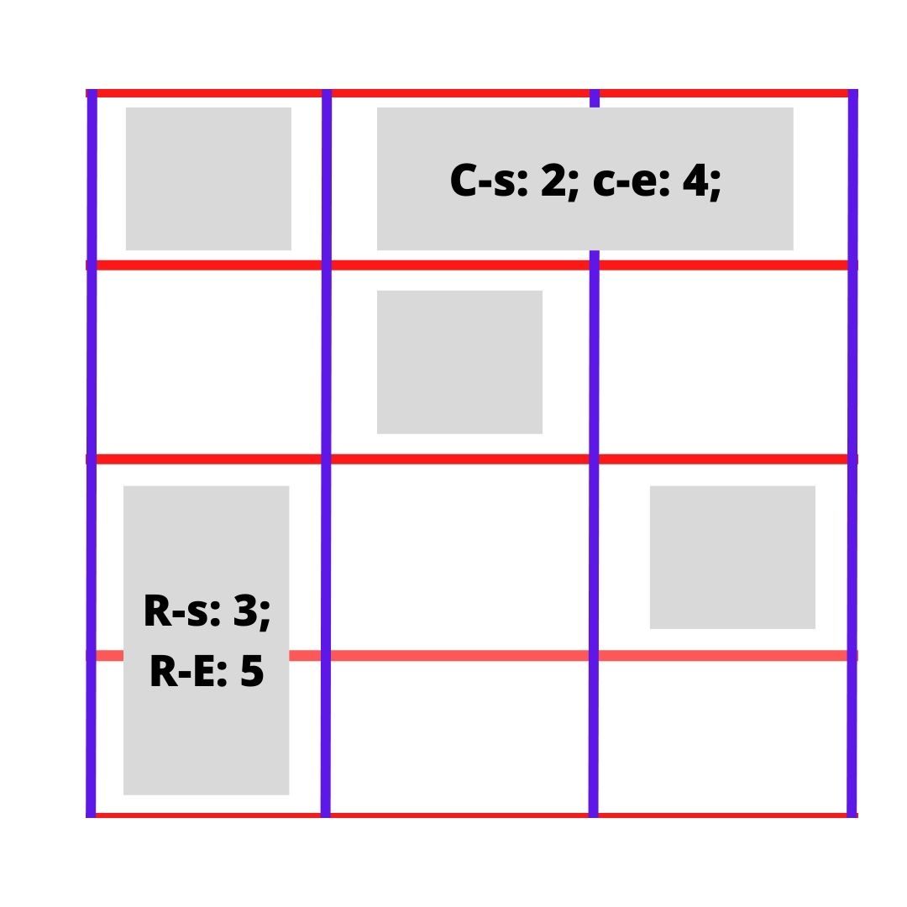
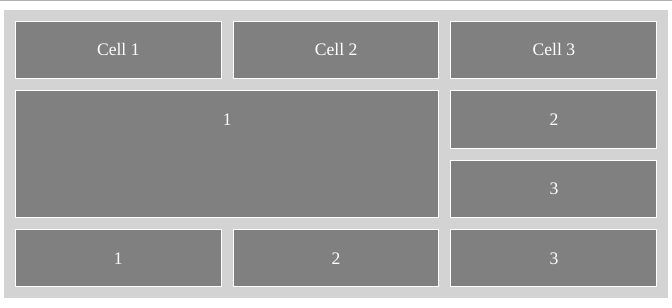

# Mengenal Grid layout 

CSS Grid adalah layout sistem 2 dimensi yang digunakn untuk melakukan pengaturan design pada halaman website.
    CSS Grid memberikan kemampuan kepada developer untuk mebuat dan mengatur kolom.
Dengan menggunakan CSS Grid kita bisa membuat suatu sistem komplex dengan mudah.

CSS Grid juga diserta dengan fitur seperti gap dan span, Yang dapat mengatur jarak antara element.

Sebelum kita mulai mempelajari mengenai penggunaan Grid, kita harus paham menggenai konsep dari "Container" dan "Item".

- Grid Conteiner:

    Untuk menggunakan fungsi layout Grid kita harus mendefinisikan Container terlebih dahulu. 

```
<main class="container">

<!-- Masukan item di area container -->

</main>

```

- Grid Item:
    Setelah mendefinisikan container. Buat dan masukan element item kedalam conteiner tersebut.
    Di bawah ini adalah contoh element yang akan kita masukan kedalam container.

```
        <div class="item item-c">
            <p>1</p>
        </div>
        <div class="item">
            <p>2</p>
        </div>
        <div class="item">
            <p>3</p>
        </div>

```

- Gunakan CSS Untuk mengaktifkan layout "Grid"

    Kita Bisa menggunakan eksternal atau internal CSS untuk melakukan modifikasi. Di contoh ini kita menggunakan Internal CSS.

```
.container {
display: grid; /* Wajib ada */

grid-template-columns: auto auto auto; /*Digunakan untuk mebuat kolom pada grid */

gap: 10px; /* Digunak untuk mengatur jarak antara baris dan kolom pada grid */

}

.item {
border: 1px solid red;
}
```

- Jika ingin mengatur panjang dan lebar kolom (Perhatian)

Selain mengatur tata letak, grid juga digunakan untuk mengatur lebar style dari element.

```
.item-c {
            grid-column-start:1 ;
            grid-column-end: 3;
        }
```

## Pengaturan luas dan jarak dengan grid



Didalam mengatur layout pada grid kita harus benar-benar memahami penempatan garis.
Karena garis tersebut akan jadi nilai yang menjadi acuan sistem dalam mengatur layout.

Sebagai contoh gambar diatas terdapat garis berwarna merah dan biru. Garis merah digunakan untuk melambangkan "Baris / row", Sedangkan garis biru melambangkan "Kolom / column".

Kotak berwna "grey" tersebut adalah contoh element jika berada di dalam "grida".

Breakdown dari gambar di atas:
- Terdapat 3 kolom, dan 4 garis kolom (Garis warna Biru)
- Terdapat 4 baris / row, dan 5 garis baris (row line) (Garis warna merah)

- Kotak persegi panjang memanjang ke kanan. 
Adalah hasil dari code

```
grid-column-start: 2;
grid-column-end: 4;

```

    Yang berfungsi untuk mengatur lebar dari element tersebut. Dimulai dari garis kolom (Garis Warna Biru) ke 2 hingga ke garis kolom ke 4.

- Kotak yang memiliki tinggi pada bagian bawah kiri. Memiliki code

```
grid-row-start: 3;
grid-row-end: 5;
```

yang berfungsi untuk mengatur tingggi dari style element. Sebagai mana pada contoh tinggi element dimulai dari garis baris(row)(garis warna merah) ke 3 hingga row ke 5.

Contoh grid Dengan pengaturan layout kolom dan baris.




## Contoh instruksi 

1. Buat fondasi HTML 

```
<!DOCTYPE html>
<html lang="en">
<head>
    <meta charset="UTF-8">
    <title></title>

    <style>

    </style>
</head>
<body>
    
</body>
</html>
```

2. Buat container untuk grid 

```
<main class="container">

</main>
```

3. Masukan Item untuk diatur, Dan menyiapkan class untuk dilakukan pengaturan lebar dengan grid. 

```
<div class="item">
            <p>Cell 1</p>
        </div>
        <div class="item">
            <p>Cell 2</p>
        </div>
        <div class="item">
            <p>Cell 3</p>
        </div>


        <div class="item item-c">
            <p>1</p>
        </div>
        <div class="item">
            <p>2</p>
        </div>
        <div class="item">
            <p>3</p>
        </div>

        <div class="item">
            <p>1</p>
        </div>
        <div class="item">
            <p>2</p>
        </div>
        <div class="item">
            <p>3</p>
        </div>

```

5. Pada Element "style" kita akan megaktifkan dan mengatur bagaimana grid berfungsi. 

```
.container {
            display: grid;
            grid-template-columns: auto auto auto;
            gap: 10px;
            background-color: lightgrey;
            color: white;
            padding: 10px;
        }
```

6. Mengatur tampilan item.
```
.item {
            border: 1px solid white;
            background-color: grey;
            text-align: center;
        }
```

7. Mengatur lebar dan tinggi pada "item-c" dengan grid.
```
.item-c {
            grid-column-start:1 ;
            grid-column-end: 3;

            grid-row-start: 2;
                grid-row-end: 4;
        }
```


- Contoh Full code:
[Masuk ke File HTML](./test-grid.html)


***
Reference: 
- https://css-tricks.com/snippets/css/complete-guide-grid/
- https://www.w3schools.com/css/css_grid.asp
